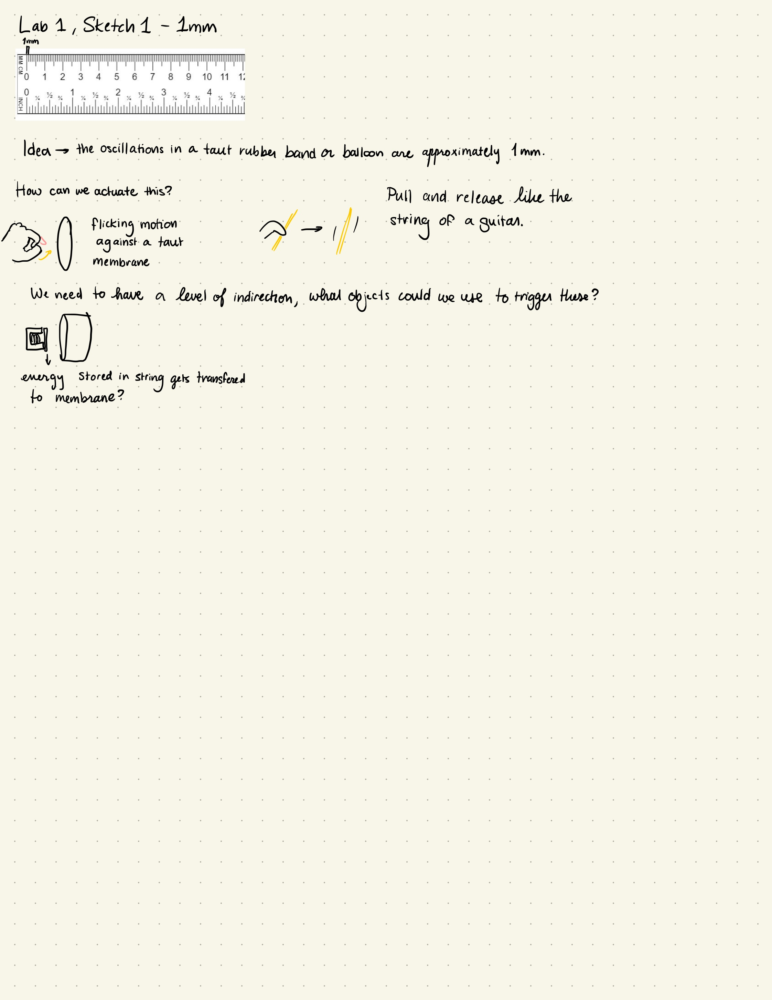
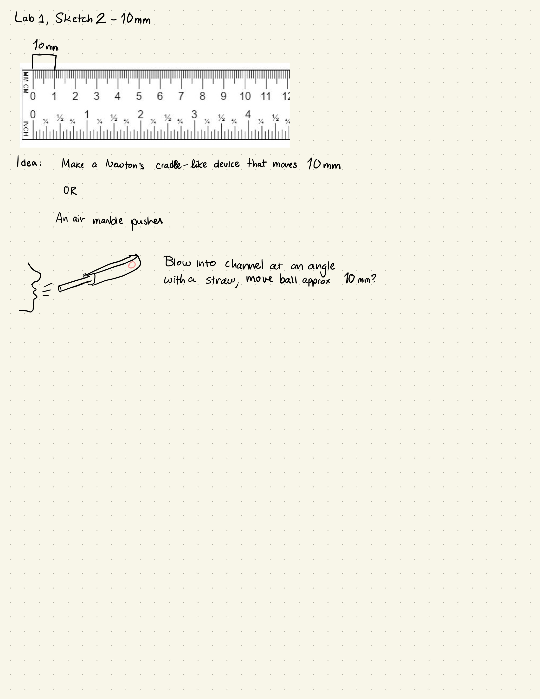
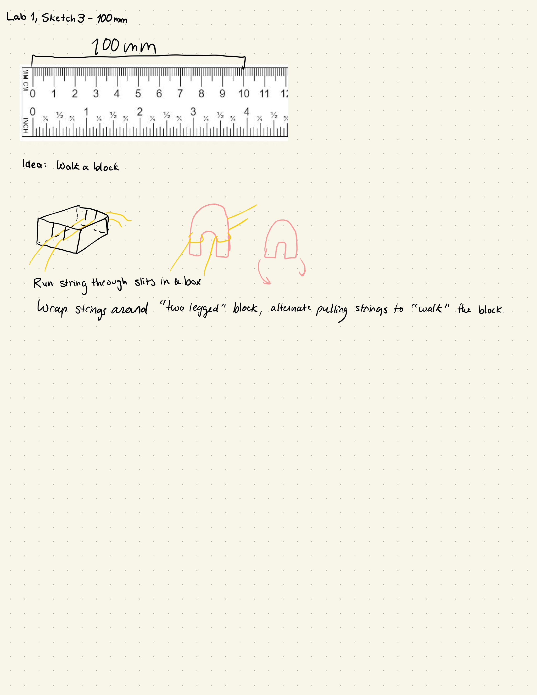

For this lab, we were tasked with making three no-tech human actuated sketches that produce different type of motion. One should move 1mm, one 10mm, and one 100mm. I started by drawing out some ideas.
{:class="img-responsive"}
{:class="img-responsive"}
{:class="img-responsive"}

Next, I gathered my materials for further inspiration.
{:class="img-responsive"}

My first attempt was to make a breath-actuated wind tunnel, which would allow you to move a wooden ball up a clear tube. I taped a straw into the tube so that the breath would be move directed. I had originally planned this to be the 10mm example, but I didn't anticipate how easy it would be to move the ball, so this became my 100mm sketch. I marked the 100mm mark on the tube.
<iframe width="560" height="315" src="https://www.youtube.com/embed/_bCzvQ0-w2g" frameborder="0" allow="accelerometer; autoplay; clipboard-write; encrypted-media; gyroscope; picture-in-picture" allowfullscreen></iframe>

This video shows the contraption in action, you can see that it works pretty well, although it took some trial and error with breath control to get the ball to hit near the right mark.
<iframe width="560" height="315" src="https://www.youtube.com/embed/T54TD8Jjkqo" frameborder="0" allow="accelerometer; autoplay; clipboard-write; encrypted-media; gyroscope; picture-in-picture" allowfullscreen></iframe>

Next I wanted to make a system that would allow you to "walK" a two legged wooden block across a surface. This was originally my 100mm sketch, but I think it works well for 10mm, since you move the block further but in small increments that are close to 10mm. I started by cutting the flaps off of a box and then cutting slits in the sides that I could run string through.
<iframe width="560" height="315" src="https://www.youtube.com/embed/OdRHCrXF2ps" frameborder="0" allow="accelerometer; autoplay; clipboard-write; encrypted-media; gyroscope; picture-in-picture" allowfullscreen></iframe>

Next I needed to attach string to each of the legs of my block. I initially tried attaching them with scotch tape, but this didn't adhere well enough to the wood, so when I tried to "walk" the figure, the string came right off and the block fell over. I solved this by glueing the string to the wood with hot glue.
{:class="img-responsive"}