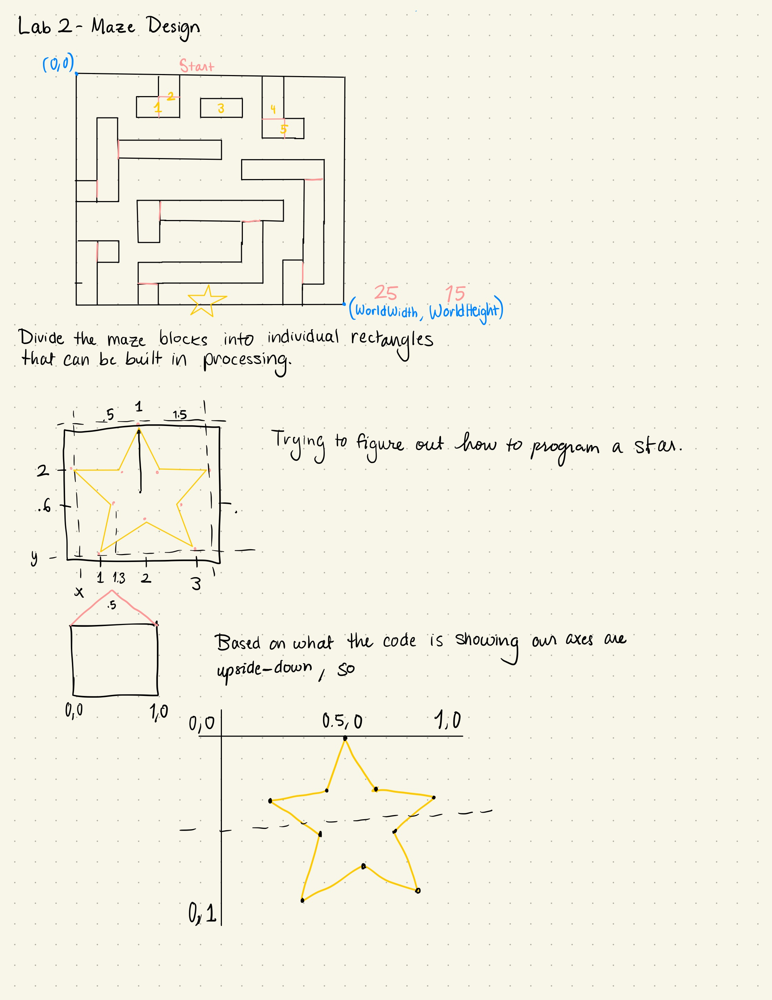
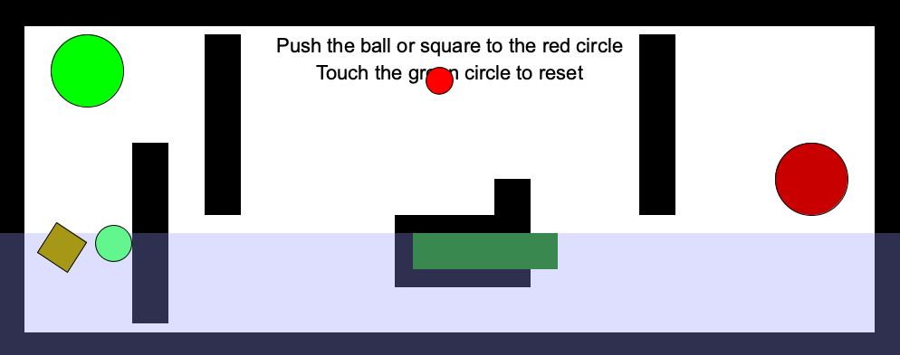

In this lab, we were tasked with setting up our Haply device, getting the software running, and modifying an existing example to make our own maze. I ran into a few issues during assembly, the biggest one being that the screwdriver included in the Haply kit was too small for the screws. I ended up buying a T6 screwdriver at home depot which did the trick.

{:class="img-responsive"}
{:class="img-responsive"}

Once I had all the software running, it was time for me to come up with an idea for the maze I wanted to build. I started by sketching what I thought a good maze might look like.
{:class="img-responsive"}
Then I started experimenting with the pre-existing demos. At first I was working on the Hello Wall example until I found out we were allowed to use the fisica library, which simplifies everything a good deal.
{:class="img-responsive"}
While experimenting, I turned the block I was working on green so that I could tell which one I was moving. I removed all of the conditionals from the Maze Physics example since I just wanted a static maze. 
{:class="img-responsive"}

<iframe width="560" height="315" src="https://www.youtube.com/embed/2fles_LEUNg" frameborder="0" allow="accelerometer; autoplay; clipboard-write; encrypted-media; gyroscope; picture-in-picture" allowfullscreen></iframe>

<iframe width="560" height="315" src="https://www.youtube.com/embed/hxXN7hy0ifc" frameborder="0" allow="accelerometer; autoplay; clipboard-write; encrypted-media; gyroscope; picture-in-picture" allowfullscreen></iframe>

And here is the final product:
<iframe width="560" height="315" src="https://www.youtube.com/embed/rexgFfQcfU8" frameborder="0" allow="accelerometer; autoplay; clipboard-write; encrypted-media; gyroscope; picture-in-picture" allowfullscreen></iframe>