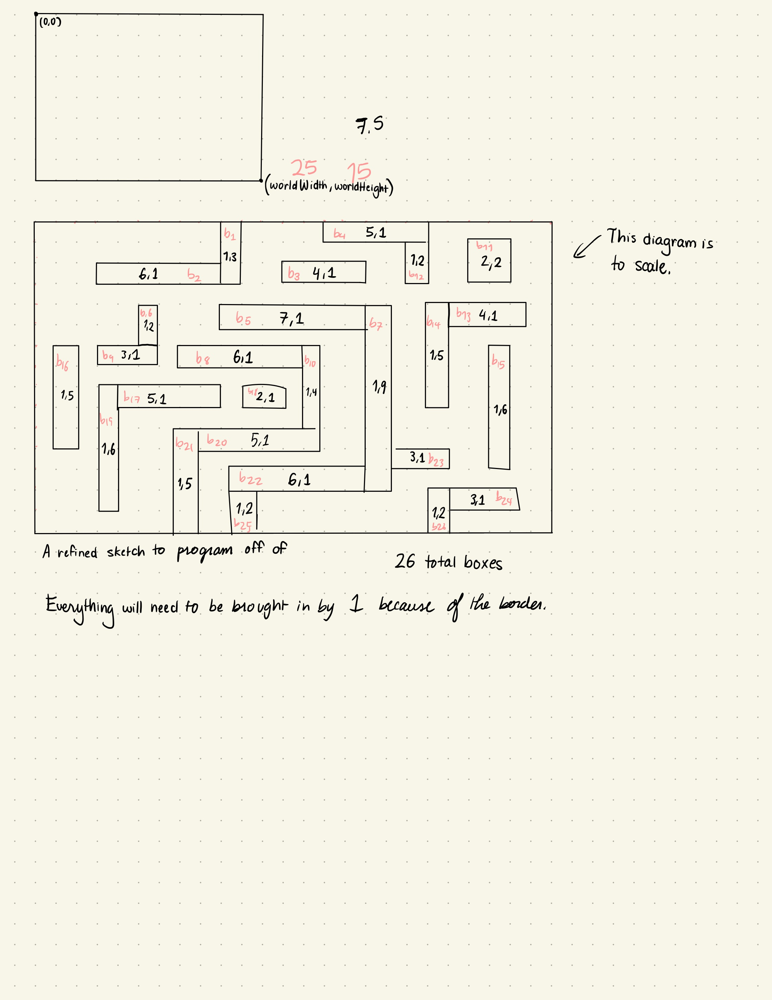

In this lab, we were tasked with setting up our Haply device, getting the software running, and modifying an existing example to make our own maze. I ran into a few issues during assembly, the biggest one being that the screwdriver included in the Haply kit was too small for the screws. I ended up buying a T6 screwdriver at home depot which did the trick (Thank you Linnea!)

{:class="img-responsive"}
{:class="img-responsive"}

I had originally set my gain to 10.0f since that was in the instructions, but it caused a bumpy sensation.
<iframe width="560" height="315" src="https://www.youtube.com/embed/i_07Q-8A3rs" frameborder="0" allow="accelerometer; autoplay; clipboard-write; encrypted-media; gyroscope; picture-in-picture" allowfullscreen></iframe>
I was able to fix this problem by setting the gain back to 1.0f at Antoine's recommendation.

Once I had all the software running, it was time for me to come up with an idea for the maze I wanted to build. I started by sketching what I thought a good maze might look like.
{:class="img-responsive"}
Then I started experimenting with the pre-existing demos. At first I was working on the Hello Wall example until I found out we were allowed to use the fisica library, which simplifies everything a good deal.
{:class="img-responsive"}
<iframe width="560" height="315" src="https://www.youtube.com/embed/2fles_LEUNg" frameborder="0" allow="accelerometer; autoplay; clipboard-write; encrypted-media; gyroscope; picture-in-picture" allowfullscreen></iframe>
While experimenting, I turned the block I was working on green so that I could tell which one I was moving. I removed all of the conditionals from the Maze Physics example since I just wanted a static maze. Once I had a version of the screen I liked without the extras from the example, I took the time to come up with a scale version of my maze to help me write it out.
{:class="img-responsive"}

I also decided to make a star to mark the goal of the maze, which turned out to be more complicated than I initially thought. While there is a Star class in Processing, in order to make one with fisica you need to use the Polygon class and add vertices one by one to make your polygon. I used Desmos to map out points so that I could understand how to make a star in Processing. I was able to directly copy the coordinates I came up with in Desmos to use in Processing.
{:class="img-responsive"}

In the following videos and images you can see the evolution of my maze. I started by creating and placing the blocks based on the scale illustration I made. I then tweaked each of the blocks to account for the margins that were not included in my sketch.
{:class="img-responsive"}
<iframe width="560" height="315" src="https://www.youtube.com/embed/hxXN7hy0ifc" frameborder="0" allow="accelerometer; autoplay; clipboard-write; encrypted-media; gyroscope; picture-in-picture" allowfullscreen></iframe>

Despite my mapping, some of the blocks did not land in their intended position.
{:class="img-responsive"}
You can see that I had more blocks than the space allowed for if I wanted the user to be able to move the ball between blocks. I ended up deleting some.

{:class="img-responsive"}

And here is the final product:
<iframe width="560" height="315" src="https://www.youtube.com/embed/rexgFfQcfU8" frameborder="0" allow="accelerometer; autoplay; clipboard-write; encrypted-media; gyroscope; picture-in-picture" allowfullscreen></iframe>

Below is my source code, note that I was experimenting with the minim and Sound packages, but didn't end up using them. In order for the code to compile, you can either download those packages, or remove the lines that use said packages.

import ddf.minim.*;
import ddf.minim.analysis.*;
import ddf.minim.effects.*;
import ddf.minim.signals.*;
import ddf.minim.spi.*;
import ddf.minim.ugens.*;

/**
 **********************************************************************************************************************
 * @file       Hello_Maze.pde
 * @author     Elie Hymowitz, Steve Ding, Colin Gallacher, Edits made by Sabrina Knappe
 * @version    V4.0.0
 * @date       08-January-2021
 * @brief      Maze game example using 2-D physics engine
 **********************************************************************************************************************
 * @attention
 *
 *
 **********************************************************************************************************************
 */

/* library imports *****************************************************************************************************/ 
import processing.serial.*;
import static java.util.concurrent.TimeUnit.*;
import java.util.concurrent.*;
import processing.sound.*;

/* end library imports *************************************************************************************************/  

/* scheduler definition ************************************************************************************************/ 
private final ScheduledExecutorService scheduler      = Executors.newScheduledThreadPool(1);
/* end scheduler definition ********************************************************************************************/ 

/* device block definitions ********************************************************************************************/
Board             haplyBoard;
Device            widgetOne;
Mechanisms        pantograph;

byte              widgetOneID                         = 5;
int               CW                                  = 0;
int               CCW                                 = 1;
boolean           renderingForce                     = false;
/* end device block definition *****************************************************************************************/

/* framerate definition ************************************************************************************************/
long              baseFrameRate                       = 120;
/* end framerate definition ********************************************************************************************/ 

/* elements definition *************************************************************************************************/

/* Screen and world setup parameters */
float             pixelsPerCentimeter                 = 40.0;

/* generic data for a 2DOF device */
/* joint space */
PVector           angles                              = new PVector(0, 0);
PVector           torques                             = new PVector(0, 0);

/* task space */
PVector           posEE                               = new PVector(0, 0);
PVector           fEE                                 = new PVector(0, 0); 

/* World boundaries */
FWorld            world;
float             worldWidth                          = 25.0;  
float             worldHeight                         = 15.0; 

float             edgeTopLeftX                        = 0.0; 
float             edgeTopLeftY                        = 0.0; 
float             edgeBottomRightX                    = worldWidth; 
float             edgeBottomRightY                    = worldHeight;

float             gravityAcceleration                 = 980; //cm/s2
/* Initialization of virtual tool */
HVirtualCoupling  s;

/* define maze blocks */
FBox              b1;
FBox              b2;
FBox              b3;
FBox              b4;
FBox              b5;
FBox              b6;
FBox              b7;
FBox              b8;
FBox              b9;
FBox              b10;
FBox              b11;
FBox              b12;
FBox              b13;
FBox              b14;
FBox              b15;
FBox              b16;
FBox              b17;
FBox              b18;
FBox              b19;
FBox              b20;
FBox              b21;
FBox              b22;
FBox              b23;
FBox              b24;
FBox              b25;
FBox              b26;

/* define start and stop button */
FCircle           c1;
FCircle           c2;

/* define goal star */
FPoly             star;

/* define game ball */
FCircle           g2;
FBox              g1;

/* define game start */
boolean           gameStart                           = true;

/* text font */
PFont             f;

/* define sound file */
SoundFile file;
Minim minim;
AudioPlayer player;
AudioInput input;

/* end elements definition *********************************************************************************************/  

/* setup section *******************************************************************************************************/
void setup(){
  /* put setup code here, run once: */
  
  /* screen size definition */
  size(1000, 700);
  
  /* set font type and size */
  f                   = createFont("Arial", 16, true);

  
  /* device setup */
  
  /**  
   * The board declaration needs to be changed depending on which USB serial port the Haply board is connected.
   * In the base example, a connection is setup to the first detected serial device, this parameter can be changed
   * to explicitly state the serial port will look like the following for different OS:
   *
   *      windows:      haplyBoard = new Board(this, "COM10", 0);
   *      linux:        haplyBoard = new Board(this, "/dev/ttyUSB0", 0);
   *      mac:          haplyBoard = 
   */
  haplyBoard          = new Board(this, "/dev/cu.usbmodem14101", 0);
  widgetOne           = new Device(widgetOneID, haplyBoard);
  pantograph          = new Pantograph();
  file = new SoundFile(this, "FFcelebrate.mp3");
  minim = new Minim(this);
  player = minim.loadFile("FFcelebrate.mp3");
  input = minim.getLineIn();
  
  widgetOne.set_mechanism(pantograph);

  widgetOne.add_actuator(1, CCW, 2);
  widgetOne.add_actuator(2, CW, 1);
 
  widgetOne.add_encoder(1, CCW, 241, 10752, 2);
  widgetOne.add_encoder(2, CW, -61, 10752, 1);
  
  
  widgetOne.device_set_parameters();
  
  
  /* 2D physics scaling and world creation */
  hAPI_Fisica.init(this); 
  hAPI_Fisica.setScale(pixelsPerCentimeter); 
  world               = new FWorld();
  
  
  /* Set maze barriers */
  b1                  = new FBox(1.0, 3.0);
  b1.setPosition(edgeTopLeftX+worldWidth/2-3, edgeTopLeftY+1.5); 
  b1.setFill(14, 130, 0);
  b1.setNoStroke();
  b1.setStaticBody(true);
  world.add(b1);
  
  b2                  = new FBox(6.0, 1.0);
  b2.setPosition(7, 3); 
  b2.setFill(14, 130, 0);
  b2.setNoStroke();
  b2.setStaticBody(true);
  world.add(b2);
   
  b3                  = new FBox(4.0, 1.0);
  b3.setPosition(15, 3); 
  b3.setFill(14, 130, 0);
  b3.setNoStroke();
  b3.setStaticBody(true);
  world.add(b3);
  
  b4                  = new FBox(5.0, 1.0);
  b4.setPosition(17, 1); 
  b4.setFill(14, 130, 0);
  b4.setNoStroke();
  b4.setStaticBody(true);
  world.add(b4);
   
  b5                  = new FBox(7.0, 1.0);
  b5.setPosition(13, 5);
  b5.setFill(14, 130, 0);
  b5.setNoStroke();
  b5.setStaticBody(true);
  world.add(b5);
  
  b6                  = new FBox(1.0, 2.0);
  b6.setPosition(7, 6);
  b6.setFill(14, 130, 0);
  b6.setNoStroke();
  b6.setStaticBody(true);
  world.add(b6);
  
  b7                  = new FBox(1.0, 9.0);
  b7.setPosition(17, 9);
  b7.setFill(14, 130, 0);
  b7.setNoStroke();
  b7.setStaticBody(true);
  world.add(b7);
  
  b8                  = new FBox(6.0, 1.0);
  b8.setPosition(12, 7.5);
  b8.setFill(14, 130, 0);
  b8.setNoStroke();
  b8.setStaticBody(true);
  world.add(b8);
  
  b9                  = new FBox(3.0, 1.0);
  b9.setPosition(6, 7);
  b9.setFill(14, 130, 0);
  b9.setNoStroke();
  b9.setStaticBody(true);
  world.add(b9);
  
  b10                  = new FBox(1.0, 6.0);
  b10.setPosition(15, 10);
  b10.setFill(14, 130, 0);
  b10.setNoStroke();
  b10.setStaticBody(true);
  world.add(b10);
  
  b11                  = new FBox(2.0, 2.0);
  b11.setPosition(22, 3); 
  b11.setFill(14, 130, 0);
  b11.setNoStroke();
  b11.setStaticBody(true);
  world.add(b11);
  
  b12                  = new FBox(1.0, 2.0);
  b12.setPosition(19, 2); 
  b12.setFill(14, 130, 0);
  b12.setNoStroke();
  b12.setStaticBody(true);
  world.add(b12);
   
  b13                  = new FBox(4.0, 1.0);
  b13.setPosition(21, 5.5); 
  b13.setFill(14, 130, 0);
  b13.setNoStroke();
  b13.setStaticBody(true);
  world.add(b13);
  
  b14                  = new FBox(1.0, 5.0);
  b14.setPosition(19.5, 7.5); 
  b14.setFill(14, 130, 0);
  b14.setNoStroke();
  b14.setStaticBody(true);
  world.add(b14);
   
  b15                  = new FBox(1.0, 6.0);
  b15.setPosition(22, 10);
  b15.setFill(14, 130, 0);
  b15.setNoStroke();
  b15.setStaticBody(true);
  world.add(b15);
  
  b16                  = new FBox(1.0, 5.0);
  b16.setPosition(3, 9);
  b16.setFill(14, 130, 0);
  b16.setNoStroke();
  b16.setStaticBody(true);
  world.add(b16);
  
  b17                  = new FBox(5.0, 1.0);
  b17.setPosition(7, 9.5);
  b17.setFill(14, 130, 0);
  b17.setNoStroke();
  b17.setStaticBody(true);
  world.add(b17);
  
  b18                  = new FBox(2.0, 1.0);
  b18.setPosition(12, 10);
  b18.setFill(14, 130, 0);
  b18.setNoStroke();
  b18.setStaticBody(true);
  world.add(b18);
  
  b19                  = new FBox(1.0, 6.0);
  b19.setPosition(5, 12);
  b19.setFill(14, 130, 0);
  b19.setNoStroke();
  b19.setStaticBody(true);
  world.add(b19);
  
  b20                  = new FBox(5.0, 1.0);
  b20.setPosition(12, 12);
  b20.setFill(14, 130, 0);
  b20.setNoStroke();
  b20.setStaticBody(true);
  world.add(b20);
  

   
  b23                  = new FBox(3.0, 1.0);
  b23.setPosition(18, 11.5); 
  b23.setFill(14, 130, 0);
  b23.setNoStroke();
  b23.setStaticBody(true);
  world.add(b23);
  
  b24                  = new FBox(3.0, 1.0);
  b24.setPosition(22, 13); 
  b24.setFill(14, 130, 0);
  b24.setNoStroke();
  b24.setStaticBody(true);
  world.add(b24);
   
  b25                  = new FBox(1.0, 2.0);
  b25.setPosition(10, 13.5);
  b25.setFill(14, 130, 0);
  b25.setNoStroke();
  b25.setStaticBody(true);
  world.add(b25);
  
  b26                  = new FBox(1.0, 2.0);
  b26.setPosition(21, 13.5);
  b26.setFill(14, 130, 0);
  b26.setNoStroke();
  b26.setStaticBody(true);
  world.add(b26);
  
  star                = new FPoly();
  star.vertex(0.5, 0);
  star.vertex(0.6, 0.2);
  star.vertex(0.8, 0.2);
  star.vertex(0.7, 0.35);
  star.vertex(0.8, 0.53);
  star.vertex(0.6, 0.53);
  star.vertex(0.5, 0.7);
  star.vertex(0.4, 0.53);
  star.vertex(0.2, 0.53);
  star.vertex(0.3, 0.35);
  star.vertex(0.2, 0.2);
  star.vertex(0.4, 0.2);
  
  star.setPosition(edgeTopLeftX+worldWidth/2.0, edgeTopLeftY+worldHeight-1.5);
  star.setFill(246, 219, 0);
  star.setNoStroke();
  star.setStaticBody(true);
  world.add(star);
  
  /* Setup the Virtual Coupling Contact Rendering Technique */
  s                   = new HVirtualCoupling((0.75)); 
  s.h_avatar.setDensity(4); 
  s.h_avatar.setFill(255,0,0); 
  s.h_avatar.setSensor(true);

  s.init(world, edgeTopLeftX+worldWidth/2, edgeTopLeftY+2); 
  
  /* World conditions setup */
  world.setGravity((0.0), gravityAcceleration); //1000 cm/(s^2)
  world.setEdges((edgeTopLeftX), (edgeTopLeftY), (edgeBottomRightX), (edgeBottomRightY)); 
  world.setEdgesRestitution(.4);
  world.setEdgesFriction(0.5);
  

 
  world.draw();
  
  
  /* setup framerate speed */
  frameRate(baseFrameRate);
  
  
  /* setup simulation thread to run at 1kHz */
  SimulationThread st = new SimulationThread();
  scheduler.scheduleAtFixedRate(st, 1, 1, MILLISECONDS);
}
/* end setup section ***************************************************************************************************/

/* draw section ********************************************************************************************************/
void draw(){
  /* put graphical code here, runs repeatedly at defined framerate in setup, else default at 60fps: */
  if(renderingForce == false){
    background(255);
    textFont(f, 22);
    textAlign(CENTER);
    text("Welcome to the maze!", width/2, 60);

  
    world.draw();
  }
}
/* end draw section ****************************************************************************************************/

/* simulation section **************************************************************************************************/
class SimulationThread implements Runnable{
  
  public void run(){
    /* put haptic simulation code here, runs repeatedly at 1kHz as defined in setup */
    
    renderingForce = true;
    
    if(haplyBoard.data_available()){
      /* GET END-EFFECTOR STATE (TASK SPACE) */
      widgetOne.device_read_data();
    
      angles.set(widgetOne.get_device_angles()); 
      posEE.set(widgetOne.get_device_position(angles.array()));
      posEE.set(posEE.copy().mult(200));  
    }
    
    s.setToolPosition(edgeTopLeftX+worldWidth/2-(posEE).x, edgeTopLeftY+(posEE).y-7); 
    s.updateCouplingForce();
 
 
    fEE.set(-s.getVirtualCouplingForceX(), s.getVirtualCouplingForceY());
    fEE.div(100000); //dynes to newtons
    
    torques.set(widgetOne.set_device_torques(fEE.array()));
    widgetOne.device_write_torques();
    
    s.h_avatar.setSensor(false);
    
    /*if (s.h_avatar.isTouchingBody(star)){
      player.play();
    }
    else{
      minim.stop();
    }*/
  
  
    world.step(1.0f/1000.0f);
  
    renderingForce = false;
  }
}
/* end simulation section **********************************************************************************************/

/* helper functions section, place helper functions here ***************************************************************/

/* Alternate bouyancy of fluid on avatar and gameball helper functions, comment out
 * "Bouyancy of fluid on avatar and gameball section" in simulation and uncomment 
 * the helper functions below to test
 */
 
/*
void contactPersisted(FContact contact){
  float size;
  float b_s;
  float bm_d;
  
  if(contact.contains("Water", "Widget")){
    size = 2*sqrt(contact.getBody2().getMass()/contact.getBody2().getDensity()/3.1415);
    bm_d = contact.getBody2().getY()-contact.getBody1().getY()+l1.getHeight()/2;
    
    if(bm_d + size/2 >= size){
      b_s = size;
    }
    else{
      b_s = bm_d + size/2;
    }
    
    contact.getBody2().addForce(0, contact.getBody1().getDensity()*sq(b_s)*300*-1);
    contact.getBody2().setDamping(20);
  }
  
}

void contactEnded(FContact contact){
  if(contact.contains("Water", "Widget")){
    contact.getBody2().setDamping(0);
  }
}
*/

/* End Alternate Bouyancy of fluid on avatar and gameball helper functions */

/* end helper functions section ****************************************************************************************/
