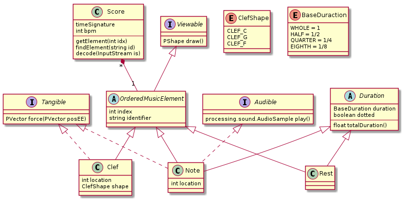

This iteration, my team and I started by brainstorming what we wanted to achieve with our project. We came up with a list of wants, needs, and nice to haves. 

**Need to have**
  - User-driven exploration
  - Tempo-driven guidance
  - Inspiration: going over scores in choir
  - Music reading
  - Support for note duration, tempo, pitch

**Want to have**
  - Music editing
  - Support for common accidentals (sharps/flats)
  - “Sticky track” to show where lines are in the music (basically a bump you cross when you go between spots in music)

**Nice to have**
  - Drag and drop functionality for haply for music editing
  - Pared down interface (focus on fundamentals, so maybe only show melody…)
  - Ability to import a song and isolate the melody (at this point this is really blue sky thinking)

Based on these goals, we decided on two priorities for our first iteration. The first was to get a functional haptics prototype that demonstrated basic user-driven exploration and showed different options for how notes and staff lines might feel. The second priority was to build a note class in processing that could be used in every iteration which implements note duration, tempo, and pitch. We divided these goals between time zones, to make communication easier. Since Juliette had previous experience with programming music notation, she and I handled the note class. Meanwhile Hannah and Rubia tackled the interaction with the Haply.

## Making a class ##

After we decided how to divide the work, Juliette and I had a meeting to discuss how we wanted to approach making the note class. One of the things we dislike about the way most processing code examples are written is that everything about it is silo'd. Processing is meant to have a setup() function that is run first, then a draw() that is run through repeatedly, animating what is on the screen. When physics are implemented with the haply, it is usually in a separate thread. Juliette and I wanted to make note objects that would have attributes and methods that could be called in an object-oriented way. We also wanted a robust class that could be modified as needed throughout the project. Below is a structure diagram showing what we planned to implement.
{:class="img-responsive"}

In this diagram, you can see that we had planned three interfaces- an audible, viewable, and tangible interface. We decided that while we create a skeleton for each interface, we would mainly attempt to implement the audible interface, and maybe the viewable interface if we had time. Juliette was actually able to execute the viewable interface in a relatively small time, and in a very visually appealing way, so we actually were able to complete one of our nice-to-haves!

### The Audible Interface ###

I was tasked with implementing the audible interface. I did some investigation into different audio libraries for processing, and found that minim and sound were the two most commonly used. Minim is often used for playing mp3 files, while sound is a more technical library capable of making oscillators and playing them back. In our discussions, Juliette and I decided that it made more sense to use oscillators, since they can be made to play any frequency which would keep us from having to pre-load mp3 files for every single possible note. This made sound the obvious choice for the library.


  double durationMs() {
    Fraction shape= this.getDuration();
    System.out.println("dalmation: "+shape);
    //the calls for time signature and tempo are probably wrong
    OrderedMusicElement e = (OrderedMusicElement) this;
    double tempo = e.parent.tempo;
    System.out.println("Tempo: "+tempo);
    OrderedMusicElement tsObj = e.getPrevious(TimeSignature.class);
    Fraction tsFrac;
    if (tsObj != null) {
      TimeSignature ts = (TimeSignature) e.getPrevious(TimeSignature.class);
      println("Time sig:", ts.num, ts.den);
      tsFrac = Fraction.of(1, ts.den);
    }
    else {
      tsFrac = Fraction.of(1, 4);
    }
    double durationMs = 60/tempo;
    Fraction shape2timeFrac= (shape.divide(tsFrac));
    System.out.println("shape2time: "+shape2timeFrac);
    double shape2time= ((double) shape2timeFrac.getNumerator())/((double) shape2timeFrac.getDenominator());
    durationMs= durationMs*shape2time*1000;
    System.out.println("duration: "+durationMs);
    return durationMs;
  }



  void getSine(){
    //the notes can be found by taking the starting note and doing the following calculation: Freq = note x 2^N/12
    //the clef will determine the starting note
    Clef c = (Clef) this.getPrevious(Clef.class);
    ClefShape sh = c.shape;
    if(sh== null){
      sh= ClefShape.G;
    }
    float refnote= 0.0;
    if (sh == ClefShape.G) {  //treble clef
      //the first note is the one on the first staff line- so for this clef it is E4
      refnote= 329.628;
    }
    else if (sh == ClefShape.C) { //baritone clef??
      //the reference note is F3
      refnote= 174.61;
    }
    else {      // ClefShape.F aka bass clef
      //the reference note is G2
      refnote= 98.00;
    }
    System.out.println(this.location);
    float loc= float(this.location);
    float frequency= refnote* (float) Math.pow(2, (loc/12.0));
    System.out.println(frequency);
    sine.freq(frequency);
    sine.amp(0.5);
    
  }


Our team met one last time the day before the deadline to discuss how we wanted to proceed with our project. One of our mentors (Oliver Schneider) was present to help inform our plans. We decided that the haptic aspects had not developed as far as we had wanted in the first iteration- specifically that user-drive exploration had not been explored at all yet. We also realized through discussion that all of us had a different conception of what user-driven exploration would look like. We realized that this was actually a good thing since it would allow us to prototype different options for that functionality that we could evaluate for the next iteration. We decided that the next step would be low-fi prototypes that we could use to demonstrate what we imagined at our next meeting.