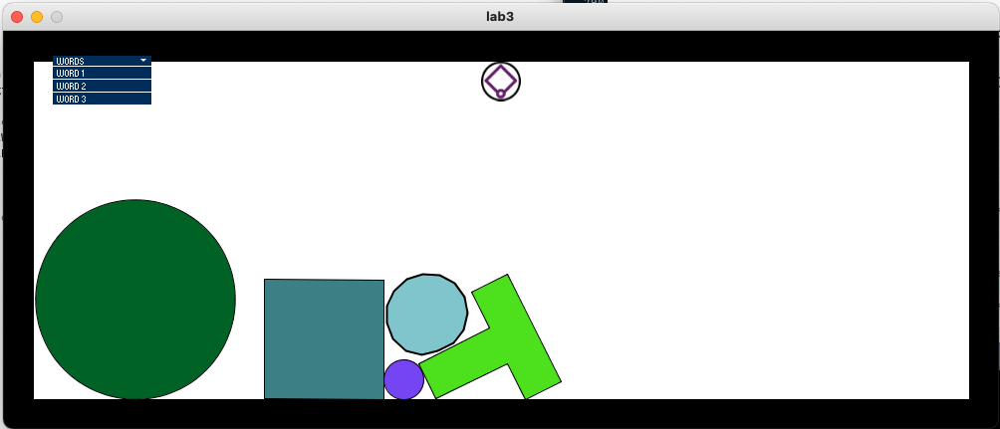

This lab asked us to create three sketches that express words.
The following images show my sketching and ideation for the assignment.

I tried to use a dropdown menu to navigate between sketches. 
{:class="img-responsive"}
However, I was unable to execute three sketches within a reasonable time frame. I could not get them integrated into a single sketch, and since I was approaching 10-12 hours of working on the lab, I decided that it was best to move on. I was able to get one sketch working, the pacing sketch involving the end effector moving back and forth. I used <a href="http://processing.flosscience.com/processing-for-android/macul-2012/make-an-object-move">this website</a> as a reference for how to make an object move back and forth. I tested this sketch on my sister which you can see in the following video:
<iframe width="560" height="315" src="https://www.youtube.com/embed/EMarOCj2Q6Y" frameborder="0" allow="accelerometer; autoplay; clipboard-write; encrypted-media; gyroscope; picture-in-picture" allowfullscreen></iframe>
She wasn't very certain about her guesses, and figured that since the motion of the haply had a bit of a curve to it that it was not either happiness or sadness. In order to effectively convey something with the Haply, I would need significantly more time to work out the particularities of the movement.

I think what I learned the most from this lab was that I am not familiar enough with the workings of Processing and its communication with the Haply to write something myself from scratch.
