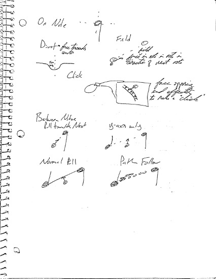
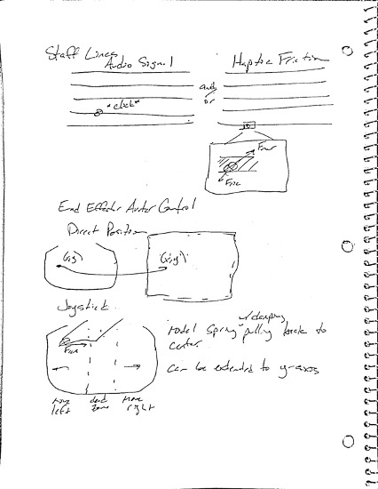
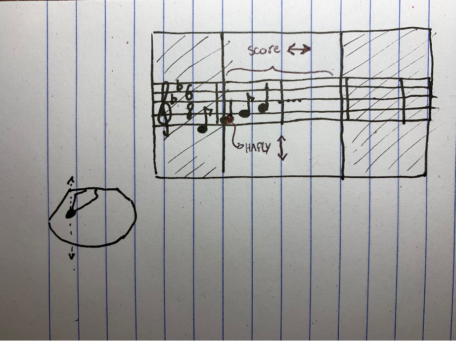
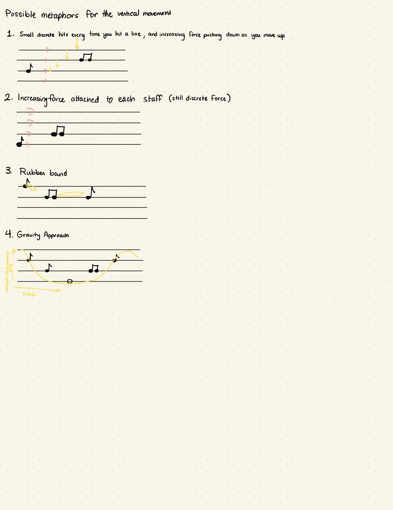
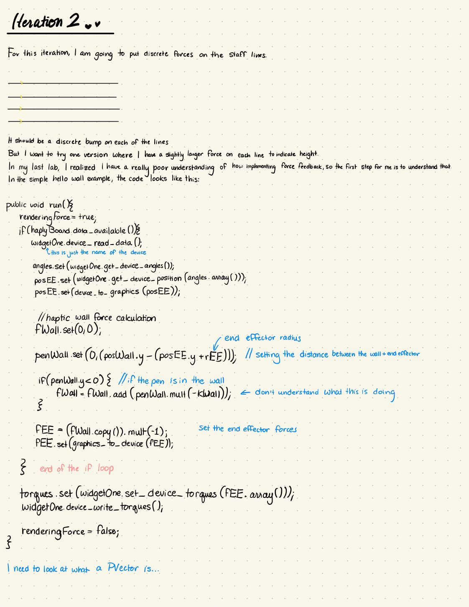
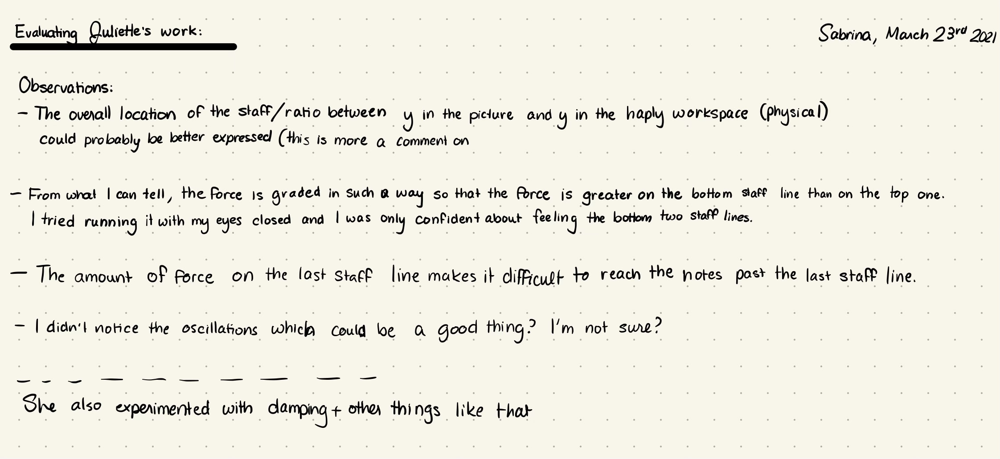

## The Prototyping Session ##
Last iteration, my team decided that we wanted to start this iteration with a brainstorming session where we would present a lo-fi prototype or sketch of how we feel that the interaction could look like. We decided to do this because of the confusion over what we were trying to achieve might look like. I used cardboard and a knob to mockup the type of movement I thought might be useful for our project. Our project goal is to create an application that can help individuals with dyslexia who want to learn music gain intuition about musical scores. The primary problem that individuals with dyslexia suffer from when trying to read music is an inability to tell which staff line a note is on. I wanted something that would allow you to move horizontally along the time axis and would move you vertically to meet the notes on the staff. My hypothesis is that the up and downward motion would help reinforce the vertical position of the notes. Below is a video of my prototype in action.

<iframe width="560" height="315" src="https://www.youtube.com/embed/XIBzXrAc628" title="YouTube video player" frameborder="0" allow="accelerometer; autoplay; clipboard-write; encrypted-media; gyroscope; picture-in-picture" allowfullscreen></iframe>

Here are some sketches that other team members provided. <a href="https://docs.google.com/document/d/1YQwnkiD-qOG7o56Um0f-AZjMjRw0-7mZSucxkRxVg_E/edit?usp=sharing">The notes from the prototyping meeting can be viewed here</a>:

{:class="img-responsive"}
{:class="img-responsive"}
{:class="img-responsive"}
{:class="img-responsive"}

We realized that our sketches fell into one of two categories, that had mostly to do with the way the time axis was controlled. In Hannah and Rubia's conception of the program, the time would be constant and pre-programmed, and the haply would simply move you arm up and down. We called this the "rockband" strategy, after the video game where the notes move towards you. In my conception, the user would control the speed at which notes played. Both options have their downsides. The main problem with the "rockband" strategy is that it doesn't allow the user to move and their own pace, or to move back and forth temporally, which we thought might be important when building intuition (you can picture a user moving and back and forth between two notes to hear the difference). The problem with my conception is that it would limit how many notes could be included in one screen and require the user to page between sections of the score somehow. We ultimately ended up going with my strategy because of the potential benefits in solving our problem. This meant we had to come up with a way for users to move between sections of the score. In the end we settled for using the arrow keys to move through various windows on the screen, each of which would contain a measure of music.

**How to evaluate this iteration**
  - Are users able to meaningfully distinguish between note pitches?
  - Are users able to meaningfully distinguish between note durations?
  - Is there an understanding of causality?
  - Do users enjoy the application?

We created a questionnaire together designed to answer these questions, that was based off of a questionnaire created in a previous meeting.
<iframe src="https://docs.google.com/forms/d/e/1FAIpQLSdF1nb3JWGK2CD8vBRY9muogc-7dK5ZV_FUC1nbfvIpESUTew/viewform?embedded=true" width="640" height="200" frameborder="0" marginheight="0" marginwidth="0">Loading…</iframe>

**Goals for this iteration**
  - Implement texture on notes
  - Implement forces to move the user between notes
  - Evaluate the results

Based on these goals, we decided to split into two teams like we did for the last iteration. Juliette and I would focus on the forces, and Rubia and Hannah would focus on the textures. We would help each other evaluate our prototypes.

## Guided Movement ##
Initially Juliette and I had discussed forces that would nudge the user from one note to the next. During one of our classes, we learned about various methods of guiding movement for haptics, but we were unsure about which method to use, so we scheduled a meeting with our instructor Karon MacLean to get some insight on which strategy to use. After we explained our project goals to Karon, she pointed out that humans aren't particularly good at the type of fine proprioception we would be relying on if we used only vertical movement to convey the position of the notes in the staff. She encouraged us to try other metaphors to convey position in relation to the staff. The image below shows the three metaphors we decided to try:
{:class="img-responsive"}

## Implementing Vertical Forces ##

While Juliette focused on implementing gaussians and spring forces, I decided to work on discrete but graded forces on the staff lines. In the last lab (Lab 3) I realized that my understanding of how haply and processing interact in terms of communicating forces was not good, so I started by going through some basic code to better understand what is happening.

{:class="img-responsive"}

Below is my code contribution. The variable goUp can be changed in the main .pde file to indicate whether the forces should increase or decrease as you go down the staff lines.


  private PVector staffForce(PVector posEE, PVector velEE, PShape line) {
    PVector linePos = getPhysicsPosition(line);
    PVector force= new PVector(0, 0);
     //each case of these types of forces will get a different amount of force
    if (abs(posEE.y - linePos.y) < 0.0005) {
      if(goUp){
        if(linePos.y == 0.07125){
          //System.out.println("hello");
          return new PVector(1,2);
        }
        if(linePos.y == 0.07625){
          //System.out.println("how");
          return new PVector(1,1.75);
        }
        if(linePos.y == 0.08125){
          //System.out.println("are");
          return new PVector(1,1.5);
        }
        if(linePos.y == 0.08625){
          //System.out.println("you");
          return new PVector(1,1.25);
        }
        if(linePos.y == 0.09125){
          //System.out.println("today");
          return new PVector(1,1);
        }
        else{
            //System.out.println("didn't work");
        }
      }
      else{
        if(linePos.y == 0.07125){
          //System.out.println("hello");
          return new PVector(1,1);
        }
        if(linePos.y == 0.07625){
          //System.out.println("how");
          return new PVector(1,1.25);
        }
        if(linePos.y == 0.08125){
          //System.out.println("are");
          return new PVector(1,1.5);
        }
        if(linePos.y == 0.08625){
          //System.out.println("you");
          return new PVector(1,1.75);
        }
        if(linePos.y == 0.09125){
          //System.out.println("today");
          return new PVector(1,2);
        }
        else{
            //System.out.println("didn't work");
        }
      }

      //return new PVector(1, 1);
    }
    return force;
  }


The main problem I ran into when programming this was how to detect where a line was vertically, since each line would have a different amount of force. It turns out that I was able to get the vertical positions of the lines and use those to assign a different amount of force. I chose to go between 1 and 2 in increments of .25 since when I tried them these seemed to be different enough forces that also weren't of high enough magnitude to feel like a serious push (and thus interfere with your ability to use the program).

I also did a brief evaluation of Juliette's work, so that we could prepare for gathering outside feedback. The main thing that I noticed from both of our prototypes was that things felt very close together vertically, and this would probably interfere with our goal of communicating information about the vertical position of the notes.
{:class="img-responsive"}

## User Testing ##
My principle contribution to this iteration was creating a user testing protocol and carrying it out with my family as participants. I have video recordings of them giving consent, but I won't include them here for privacy reasons. Below is an outline of the user testing procedure.

Versions to test:
Gaussian only (JR)
Spring only (JR)
Gaussian+spring (JR)
Discrete graded up (SK)
Discrete graded down (SK)

Test all versions on user with no visual or audio feedback (haptic test only). Guide their hand to be above the staff line, instruct them to move their arm up and down. For each version, ask the following:
 - Please describe what you feel.
Test all versions with audio and visual and haptics turned on. Let them freely explore. Ask the following:
 - How does this compare with the previous version of the prototype?
Send them the modified questionnaire.



Juliette and I had a call where we modified the questionnaire to remove the questions that delt with note duration, since our prototype is geared towards distinguishing note pitch. The modified questionnaire is included below:
<iframe src="https://docs.google.com/forms/d/e/1FAIpQLSfQYB43hZJIjVTStAmyP7I-fTb4hOAfTf0l6oybQswc42Iw-g/viewform?embedded=true" width="700" height="200" frameborder="0" marginheight="0" marginwidth="0">Loading…</iframe>
The following subsections include fairly long snippets of the user testing. However, the gist of what was done can be garnered in the first 30-45 seconds of each video. If you are reviewing this post for grading, please don't feel obligated to watch these videos in their entirety. I included the full footage to help my team members and anyone else who wants to see more detailed user responses.

### Juliette's Prototype ###
This first video shows participants testing Juliette's prototype with each of the three settings. I asked them to describe what they felt for each of the versions.
<iframe width="560" height="315" src="https://www.youtube.com/embed/hUSQNEccS8Y" title="YouTube video player" frameborder="0" allow="accelerometer; autoplay; clipboard-write; encrypted-media; gyroscope; picture-in-picture" allowfullscreen></iframe>
All the users were able to identify the staff line forces, describing them as "bumps" or "ridges." One participant correctly identified that there were five. None of the participants were able to correctly identify the fact that the force was graded. The participants also didn't understand the function associated with the spring forces. They felt that it was there but had a difficult time putting into words what they were feeling. Some described it simply as being harder to control. When both the gaussian line forces and the spring forces were turned on, there was some interference that made 

### My Prototype ###
My prototype was run twice, once with the forces going from small magnitude at the bottom to large magnitude at the top and the other from large magnitude at the bottom to small magnitude at the top.
<iframe width="560" height="315" src="https://www.youtube.com/embed/0rZ2C7HI6zQ" title="YouTube video player" frameborder="0" allow="accelerometer; autoplay; clipboard-write; encrypted-media; gyroscope; picture-in-picture" allowfullscreen></iframe>
The feedback on my prototype was not particularly positive. There was oscillation when the end effector sat next too close to the lines for a long time, and this confused participants. They were not able to clearly pick out the lines immediately. They also did not notice the gradation in forces, which was the desired effect of my prototype. Because the feedback was so mixed and no distinctions were meaningfully picked out from this prototype, I decided to cut it from the final round of tests.

### Juliette's Prototypes with Audio and Visuals ###
For the last testing session, two of the participants went through Juliette's prototype again on each setting, this time with visuals and audio on.
<iframe width="560" height="315" src="https://www.youtube.com/embed/ogh7KNzVjsI" title="YouTube video player" frameborder="0" allow="accelerometer; autoplay; clipboard-write; encrypted-media; gyroscope; picture-in-picture" allowfullscreen></iframe>
This set of tests yielded the most interesting insights. Users had a difficult time playing notes when there was a line through them, since the line force would push them away from the note. The other main problem that I noticed was that participants seemed rather aimless when interacting with the score. It was not immediately obvious to them what they should do in the program. As one participant said in the survey:
> I couldn’t figure out it was a score and then I had no way of understanding where it started and how to move my hand in order to actually hit the notes in the right direction.

This is a pretty serious unexpected problem that we will have to address in our next iteration. It is worth noting that the behavior shown in the video where the participants were moving their cursor up and down instead of through the notes in order may have to do with the instructions they were given in previous tests to move the end effector up and down. As anticipated, the users noticed the haptics a lot less when they had audio and visual information to process as well.

## Future Plans ##
My user testing answered many of our questions in ways that we didn't hope for, but they also revealed problems with our prototypes that we weren't able to identify ourselves. In light of this, we will be using the next iteration to rapidly prototype different options and have other course members as well as family and friends test them in order to find the right balance between textures and line forces. Two other aspects which we are going to prototype and test are the ratio of vertical space on the screen to vertical space in the haply workspace, and the nudges to move users from note to the next. We are hoping that changing the ratios of vertical space might help emphasize vertical position of notes and that nudges might reduce the confusion as to what a user should do when interacting with the score. My main takeaway from this iteration is that the haply is not a precision device, and that communicating nuanced information, such as gradations in force, may not be effective. To combat this, we will have to get creative with our haptic metaphors.