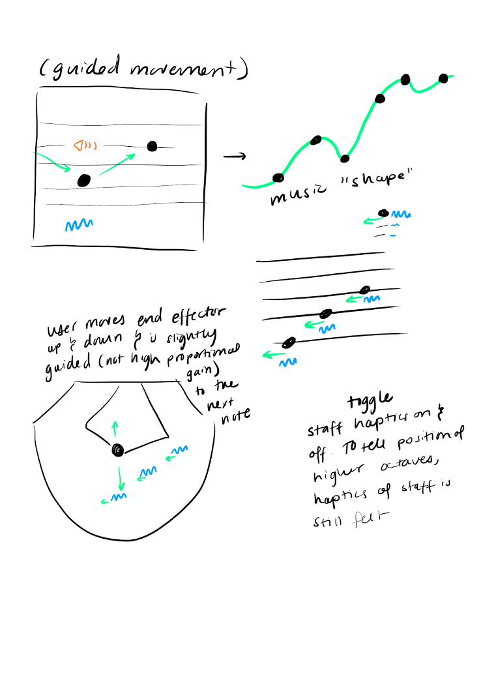

## The Prototyping Session ##
Last iteration, my team decided that we wanted to start this iteration with a brainstorming session where we would present a lo-fi prototype or sketch of how we feel that the interaction could look like. We decided to do this because of the confusion over what we were trying to achieve might look like. I used cardboard and a knob to mockup the type of movement I thought might be useful for our project. Our project goal is to create an application that can help individuals with dyslexia who want to learn music gain intuition about musical scores. The primary problem that individuals with dyslexia suffer from when trying to read music is an inability to tell which staff line a note is on. I wanted something that would allow you to move horizontally along the time axis and would move you vertically to meet the notes on the staff. My hypothesis is that the up and downward motion would help reinforce the vertical position of the notes. Below is a video of my prototype in action.

<iframe width="560" height="315" src="https://www.youtube.com/embed/XIBzXrAc628" title="YouTube video player" frameborder="0" allow="accelerometer; autoplay; clipboard-write; encrypted-media; gyroscope; picture-in-picture" allowfullscreen></iframe>

Here are some sketches that other team members provided. <a href="https://docs.google.com/document/d/1YQwnkiD-qOG7o56Um0f-AZjMjRw0-7mZSucxkRxVg_E/edit?usp=sharing">The notes from the prototyping meeting can be viewed here</a>:

{:class="img-responsive"}
{:class="img-responsive"}
{:class="img-responsive"}
{:class="img-responsive"}

We realized that our sketches fell into one of two categories, that had mostly to do with the way the time axis was controlled. In Hannah and Rubia's conception of the program, the time would be constant and pre-programmed, and the haply would simply move you arm up and down. In my conception 

**Goals for this iteration**
  - Implement texture on notes
  - Implement forces to move the user between notes
  - Evaluate the results

**How to evaluate this iteration**
  - Are users able to meaningfully distinguish between note pitches?
  - Are users able to meaningfully distinguish between note durations?
  - Is there an understanding of causality?
  - Do users enjoy the application?

We created a questionnaire together designed to answer these questions, that was based off of a questionnaire created in a previous meeting.

Based on these goals, we decided to split into two teams like we did for the last iteration.

## Guided Movement ##

{:class="img-responsive"}

## Implementing Vertical Forces ##

While Juliette focused on implementing gaussians and spring forces, I decided to work on discrete but graded forces on the staff lines. In the last lab (Lab 3) I realized that my understanding of how haply and processing interact in terms of communicating forces was not good, so I started by going through some basic code to better understand what is happening.

{:class="img-responsive"}

Below is my code contribution. The variable goUp can be changed in the main .pde file to indicate whether the forces should increase or decrease as you go down the staff lines.


  private PVector staffForce(PVector posEE, PVector velEE, PShape line) {
    PVector linePos = getPhysicsPosition(line);
    PVector force= new PVector(0, 0);
     //each case of these types of forces will get a different amount of force
    if (abs(posEE.y - linePos.y) < 0.0005) {
      if(goUp){
        if(linePos.y == 0.07125){
          //System.out.println("hello");
          return new PVector(1,2);
        }
        if(linePos.y == 0.07625){
          //System.out.println("how");
          return new PVector(1,1.75);
        }
        if(linePos.y == 0.08125){
          //System.out.println("are");
          return new PVector(1,1.5);
        }
        if(linePos.y == 0.08625){
          //System.out.println("you");
          return new PVector(1,1.25);
        }
        if(linePos.y == 0.09125){
          //System.out.println("today");
          return new PVector(1,1);
        }
        else{
            //System.out.println("didn't work");
        }
      }
      else{
        if(linePos.y == 0.07125){
          //System.out.println("hello");
          return new PVector(1,1);
        }
        if(linePos.y == 0.07625){
          //System.out.println("how");
          return new PVector(1,1.25);
        }
        if(linePos.y == 0.08125){
          //System.out.println("are");
          return new PVector(1,1.5);
        }
        if(linePos.y == 0.08625){
          //System.out.println("you");
          return new PVector(1,1.75);
        }
        if(linePos.y == 0.09125){
          //System.out.println("today");
          return new PVector(1,2);
        }
        else{
            //System.out.println("didn't work");
        }
      }

      //return new PVector(1, 1);
    }
    return force;
  }


## Putting it Together ##
We had a meeting on the Wednesday before the iteration was due to discuss our individual segments and how to best combine everything. Juliette and I both spent some time playing with the haptic elements Hannah and Rubia worked on and gave them feedback. I found that I really liked the small amount of force that was felt when I encountered notes. Rubia and Hannah were concerned that the amount of force wasn't enough but in my opinion since it will be reinforced by audio feedback as well, a small amount of force is acceptable. We all agreed that in order to really gauge the effectiveness of the haptics, everything would need to be put together. While I was solving some problems with the audible interface (I initially made a few arithmetic errors with the execution of the duration code), Juliette added the haptic forces Rubia and Hannah had developed to the class. Here's what it looks like all together (without audio, which will have to be fixed later):

<iframe width="560" height="315" src="https://www.youtube.com/embed/k-wCByPHNAM" frameborder="0" allow="accelerometer; autoplay; clipboard-write; encrypted-media; gyroscope; picture-in-picture" allowfullscreen></iframe>

Of my team, I had the least technical understanding of sheet music, so this iteration was a great learning experience for me to better understand how sheet music works. It was also really useful for me to get more experience working collaboratively with someone on an application. I really benefited from Juliette's experience with code review.

## Future Plans ##

My user testing answered many of our questions in ways that we didn't hope for. As a result, we are going to need to focus our efforts on